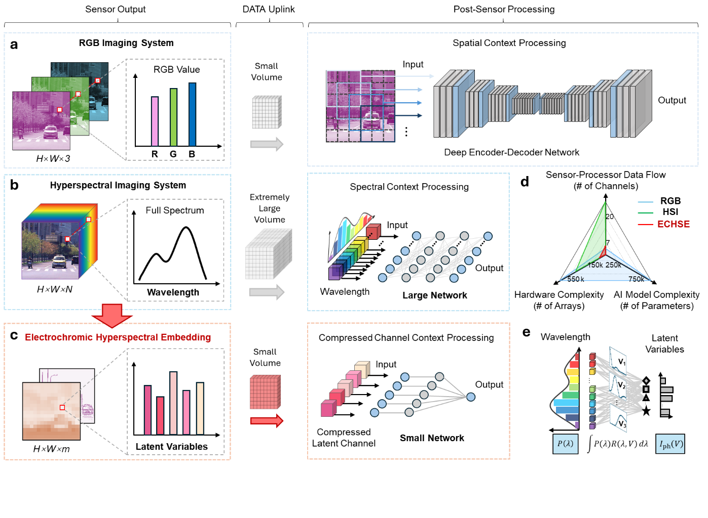
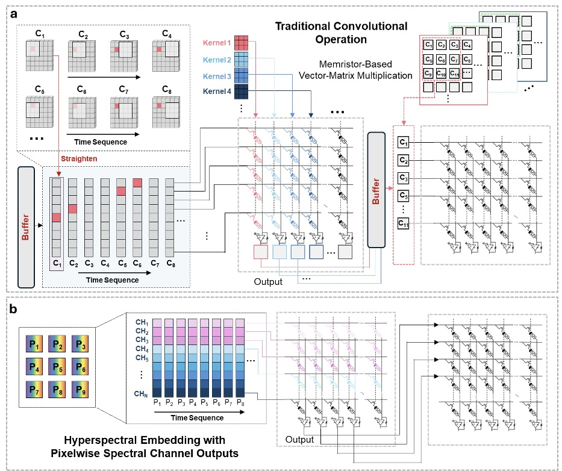
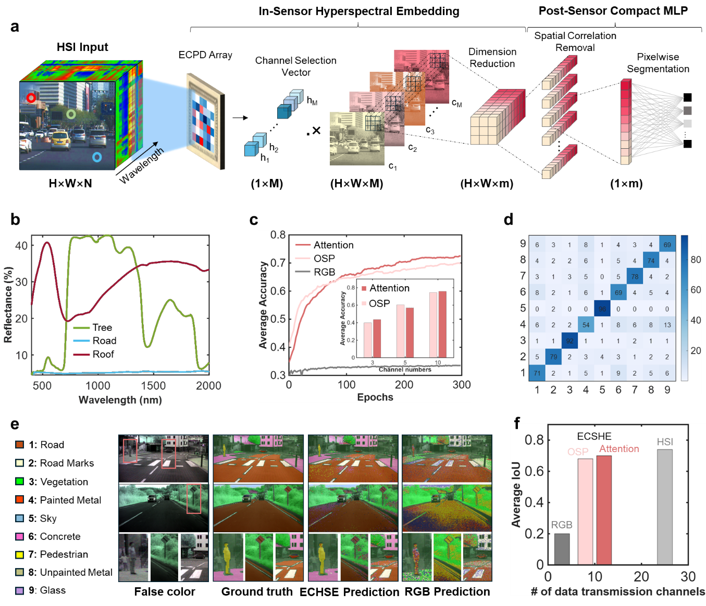

# Electrochromic Hyperspectral Embedding (ECHSE) for Ultra-Compact Intelligent Vision

Repository containing code and experiments for **Electrochromic Hyperspectral Embedding (ECHSE)** — an in-sensor computing framework that adaptively compresses spectral information at the pixel level for compact, energy-efficient intelligent vision.
 
---

## Overview

Conventional vision systems separate sensing from computation, producing large data streams that increase power consumption and system complexity. **ECHSE** exploits electrically tunable photocurrent responses in electrochromic photodetectors so that each pixel can selectively encode its most task-relevant spectral components before readout. The resulting low-dimensional outputs interface with lightweight analogue computing hardware for efficient inference.


This repository provides:

- **Post-sensor neural network models** for semantic segmentation on hyperspectral data (Pixel MLP, Transformer, FCNN)
- **HSI Drive**–style evaluation: pixel-wise classification with compressed spectral inputs (e.g. OSP / attention-weighted channels, dual-capture, or raw bands)
- **Training and evaluation** scripts with IoU reporting and confusion matrices
- **MATLAB utilities** for band selection, PCA, and dataset preprocessing

Compared with conventional AI vision pipelines, ECHSE reduces data transmission by more than an order of magnitude while maintaining high classification accuracy, offering a materials-to-system pathway toward compact, high-speed, energy-efficient intelligent vision for edge applications.


---
## Directory Structure

This repository contains the **ECHSE codebase**  (ECHSE experiments for HSI Drive and pixel-level models):

```
├── Pixel_MLP/                 # Pixel MLP & Transformer training and evaluation
│   ├── src/                    # model.py, transformer_model.py
│   ├── train_utils/            # training loops, evaluation, LR scheduler
│   ├── test_IoU_for_R.py       # evaluate; IoU vs R matrix index
│   ├── train_HSI_drive.py      # training script
│   ├── my_dataset.py           # HSI_Drive_V1_ dataset (OSP, dual, attention, raw)
│   └── multi_train/            # checkpoints, confusion matrices, logs
├── FCNN_HSI/                   # Fully convolutional network (FCNN) models
├── Up_seg/                     # U-Net–style segmentation
├── bandselection_in_subforder.m
├── bandPCA_in_subforder.m
├── assets/                     # figures (overview, results)
└── ...
```

---

## Setup

### 1. Clone and enter repository

```bash
git clone <repository-url>
cd EC_dataset
```

### 2. Environment

- **Python** 3.8+ (tested with 3.10)
- **PyTorch** (CUDA recommended for training)
- **Libraries:** `numpy`, `scipy`, `matplotlib`, `pandas`, `tensorboard`, `Pillow`

Example with conda:

```bash
conda create -n echse python=3.10
conda activate echse
pip install torch torchvision
pip install numpy scipy matplotlib pandas tensorboard Pillow
```

### 3. Data

Place the **HSI Drive** dataset (or your HSI dataset with the same structure) at a path of your choice. To download our dataset, please use [this link](https://ipaccess.ehu.eus/HSI-Drive/).

Adjust `--data_path` in the training/evaluation scripts accordingly. The dataset loader in `Pixel_MLP/my_dataset.py` supports:

- **OSP** (orthogonal subspace projection) and **PCA**-style reduced channels  
- **Attention-weighted** channels (learned or fixed R matrices)  
- **Raw** band subsets  
- **RGB** (3 channels)

See the manuscript and SI (e.g. Fig. S18, HSI-Drive flow) for the intended ECHSE pipeline and R matrix design.

---

## Usage

### Training (Pixel MLP)

From the repository root, run training with `train_HSI_drive.py`:

```bash
python Pixel_MLP/train_HSI_drive.py --data_path /path/to/HSI_Drive/v1/ \
  --output-dir ./Pixel_MLP/multi_train/HSI_drive/atten/large/ \
  --epochs 500 --use_attention True --use_large_mlp True
```

Key flags:

- `--use_OSP` / `--use_attention` / `--use_dual` / `--use_raw` / `--use_rgb`: input modality  
- `--num_attention`: number of attention/OSP channels  
- `--use_large_mlp`: large vs small MLP  
- `--resume`: path to checkpoint to resume training  
- `--test-only`: run evaluation only (no training)  

### Evaluation and IoU sweep for R matrix with variation

`test_IoU_for_R.py` loads one checkpoint and evaluates it across one or more R matrix indices, then writes per-class IoU to a CSV. Run from the repository root.

Single R index (e.g. R=1 only):

```bash
python Pixel_MLP/test_IoU_for_R.py --R_start 1 --R_end 1 --resume ./Pixel_MLP/multi_train/HSI_drive/atten/large/R_1/model_499.pth --output_csv ./Pixel_MLP/R_IoU.csv
```

Sweep over R indices 1–32 (one row per R in the CSV):

```bash
python Pixel_MLP/test_IoU_for_R.py --R_start 1 --R_end 32 --output_csv ./Pixel_MLP/R_IoU.csv --resume /path/to/checkpoint.pth
```

Use `--resume` for the checkpoint path and `--data_path` if the dataset is not at the default location.

### Confusion matrix

After evaluation, confusion matrices can be saved under `Pixel_MLP/multi_train/` (e.g. `confusion_matrix.csv`, `confusion_matrix.svg`). See also **Supplementary Figure S19** in the SI for confusion matrices.

---

## Results

Representative results on **HSI Drive** semantic segmentation (9 classes) with the Pixel MLP and attention-weighted spectral embedding:

| Metric     | Value   |
|-----------|--------|
| Accuracy  | ~86.3% |
| Mean IoU  | ~76.4% |



Per-class IoU (example for best R index, see `Pixel_MLP/R_IoU.csv`):

- Road, Road marks, Vegetation, Painted Metal, Sky, Concrete/Stone/Brick, Pedestrian/Cyclist, Unpainted Metal, Glass/Transparent Plastic

Confusion matrix and segmentation examples are provided in the manuscript and SI (Figs. S19, S20). SHAP analysis for spectral band importance is in Fig. S21.

Result figures (confusion matrices, segmentation examples, SHAP contributions) are in the manuscript and Supplementary Information. Running evaluation saves `confusion_matrix.csv` and `confusion_matrix.svg` under `Pixel_MLP/multi_train/`.

---

## Authors and Citation

**Authors:** Ran Li, Chaoyi He, Yi Huang, Enzi Zhai, Vinod K. Sangwan, Jingyi Zou, Kevin St. Luce, Jianzhou Cui, Rex Kim, Roland Liu, Zhixing Wang, Xi Ling, Helen Xie, Xu Zhang, Mark C. Hersam, Qiangfei Xia, Linda Katehi, Yuxuan Cosmi Lin  

**Affiliations:** Texas A&M University, Northwestern University, Carnegie Mellon University, University of Massachusetts Amherst, Boston University, Google X.

If you use this code or the ECHSE framework in your work, please cite the manuscript:

```bibtex
@article{ECHSE,
  title   = {Electrochromic Hyperspectral Embedding for Ultra-Compact Intelligent Vision},
  author  = {Ran Li and Chaoyi He and Yi Huang and Enzi Zhai and Vinod K. Sangwan and Jingyi Zou and Kevin St. Luce and Jianzhou Cui and Rex Kim and Roland Liu and Zhixing Wang and Xi Ling and Helen Xie and Xu Zhang and Mark C. Hersam and Qiangfei Xia and Linda Katehi and Yuxuan Cosmi Lin},
  journal = {},
  year    = {},
  note    = {Manuscript and Supplementary Information available from the authors}
}
```

## License

Please refer to the repository license. For manuscript and SI figures, use according to the publisher’s terms.
